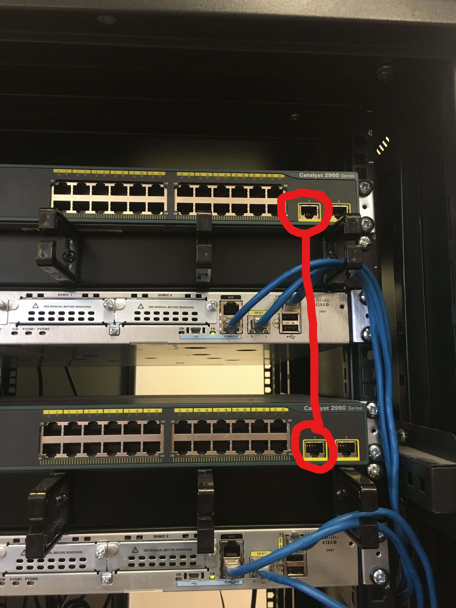
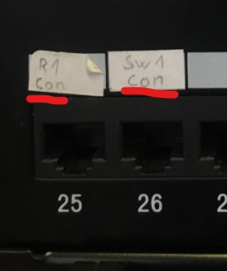

# Předkonfigurační postupy

- Zapojení consolového kabelu do počítače a switche 
- Zapojení síťového kabelu z počítače do switche
- Spojení dvou switchů pomocí síťového kabelu (viz. obrázek)



- Zapojíme kabel z boxu, na kterém jsou čísla zdířek u stolů do konzolového portu v ragu.



- Vememe kabel a natáhem z dířky kabel do switche pro spojení PC se Switchem (libovolný port ve vybraném switchi)

## Pakliže tohle máme splněno, pokročíme na další část a to základní konfiguraci.

# Základní konfigurace

- Konfigurace Vlan

```> en
> conf t
> int vlan1
> ip address IP MASKA
> no shutdown
```

- Konfigurace telnetu

```> hostname <JMENO>
> line vty 0 5
> password <HESLO>
> login
```

- Konfigurace SSH

```> hostname <jmeno>
> conf t
> ip domain-name cisco
> username cisco password cisco
> crypto key generate rsa
> 1024
> ip ssh ver 2
> line vty 0 5
> transport input ssh
> login local
> login synchronous
> exit
> service password-encryption
```

- Konfigurace IP adres na PC

```> Klepneme na ikonu v dolním panelu a otevřeme další nastavení sítě, dáme možnost upřesnit nastavení sítě, vybereme REALTEK síťový adaptér a konfigurujeme IPv4 protokol 
```

- Ověřování

```> Ověříme funkčnost Telnetu a SSH pomocí aplikace PuTTy, vybere možnost SSH nebo Telnet a vložíme IP adresu daného switche na kterém je nakonfigurovaný požadovaný protokol
> Následně zadáme heslo připadně i uživatelské jméno, pakliže vše funguje, máme všechno nastaveno správně.
```
