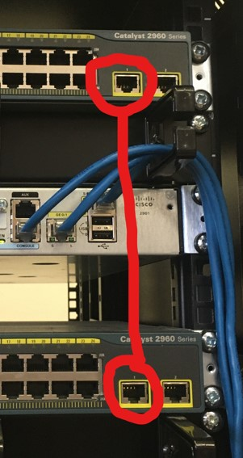

# Předkonfigurační postupy

- Zapojení consolového kabelu do počítače a switche 
- Zapojení síťového kabelu z počítače do switche
- Spojení dvou switchů pomocí síťového kabelu (viz. obrázek)




# Základní konfigurace

- Konfigurace Vlan

```> en
> conf t
> int vlan1
> ip address IP MASKA
> no shutdown
```

- Konfigurace telnetu

```> hostname <JMENO>
> line vty 0 5
> password <HESLO>
> login
```

- Konfigurace SSH

```> hostname <jmeno>
> conf t
> ip domain-name cisco
> username cisco password cisco
> crypto key generate rsa
> 1024
> ip ssh ver 2
> line vty 0 5
> transport input ssh
> login local
> login synchronous
> exit
> service password-encryption
```

